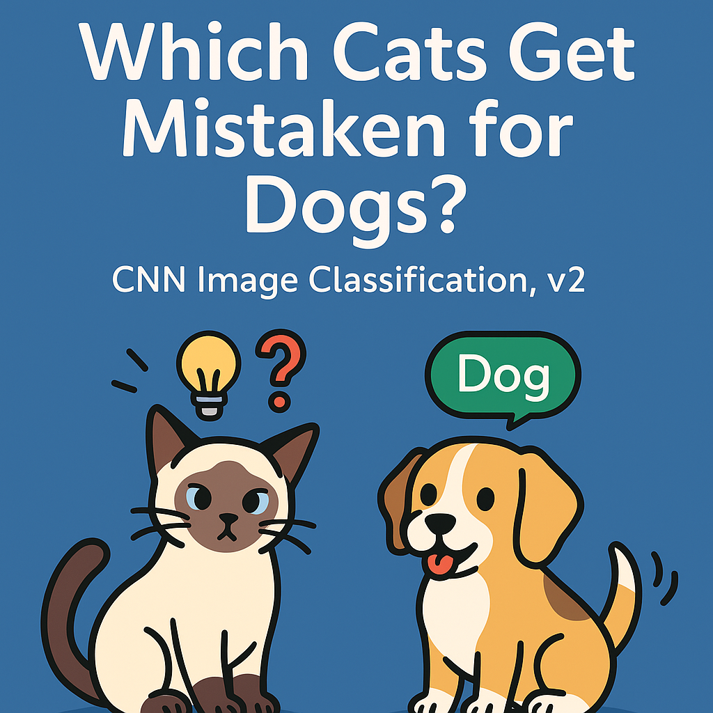
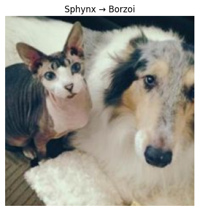
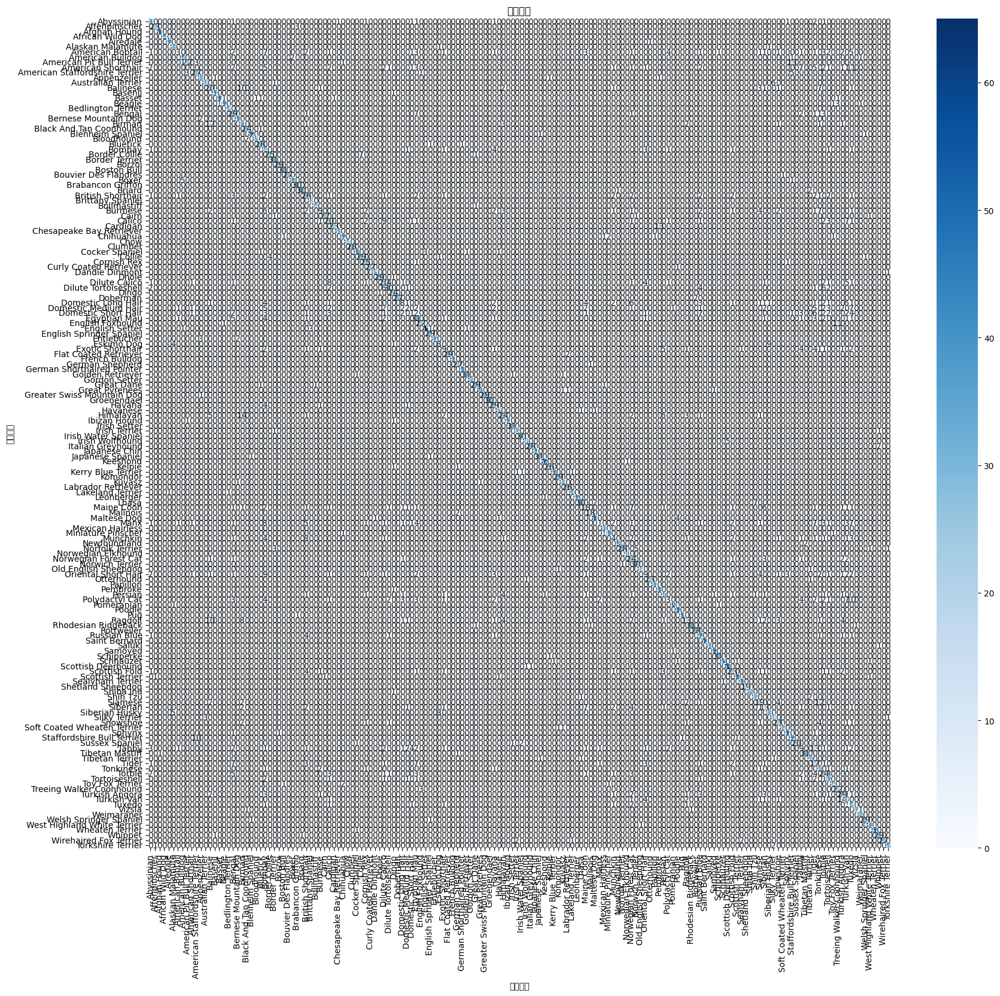

<p align="center">
  
</p>

# 🐱➡️🐶 When Cats Become Dogs (v2)  
## 🔍 A Larger-Scale Study on Cat Breeds That Are Most Likely Misclassified as Dogs  

**這是第二版研究，加入更多資料與更強模型，但也遇到更多挑戰。**  
本研究試圖回答：哪些貓品種最容易被深度學習模型誤判為狗？  
我們擴大實驗規模，加入 Kaggle Cats 與 Stanford Dogs 資料集，合併後共 **162 個貓狗品種**，並採用 **EfficientNet‑B3** 作為主模型。

**Version 2 upgrades the original project** by expanding both data and model capacity.  
More breeds (162), more images, and a deeper network — but with that comes new ambiguity and overfitting challenges.

---

## ▶️ Run the Demo on Hugging Face Spaces

[](https://huggingface.co/spaces/KikKoh/Which-Cats-Get-Mistaken-for-Dogs-in-CNN-Image-Classification))

---

## 📁 Project Structure  

````markdown
cat-vs-dog-v2/
├── README.md
├── cat_vs_dog_v2_study.ipynb               # 主實驗 Notebook
├── imgs/
│   └── sphynx_borzoi.png
├── stats/
│   ├── misclassified_summary.csv
│   ├── confusion_matrix.png
│   └── confusion_chart.png
└── model/
    └── best_effnetb3.pth                   # 儲存的最佳 EfficientNet-B3 模型
`````

---

## 🧠 Model & Dataset | 模型與資料集

* ✅ 使用 **EfficientNet‑B3**（ImageNet 預訓練）
* 📦 整合三大資料集，共計 **162 類**：

  * Oxford‑IIIT Pet Dataset
  * Stanford Dogs Dataset
  * Kaggle Cat Breeds Dataset
* 🐱 標記其中 40 種為「貓類」

---

## 📈 Training Summary

```text
📘 Epoch 18 結果:
🧠 訓練損失: 1.5819
✅ 驗證損失: 1.5595
🎯 驗證準確率: 0.7808
📉 當前學習率: 0.000035
⚠️ Early stopping: 提前結束於第 18 輪
🎉 最佳驗證準確率: 0.7969
```

---

## 🤖 Misclassification Analysis | 誤判分析

我們聚焦於「真實貓 → 預測為狗」的樣本，並定義以下條件：

* 取 **Top‑3** 並觀察是否全為狗，記為「誤判」

結果發現：

> 在大數據下，「Top‑3 全錯」的情況 **極少發生**，唯一誤判樣本是一張同時出現貓狗的圖片（資料品質問題）

> 但 Top‑1 若作為分類依據，**誤判率顯著提升**
---

## 🧪 Sample Output

```text
🐱 真實類別: Sphynx 被誤判為（Top‑3 都是狗）:
🔺 Top3: ['Borzoi', 'Collie', 'Shetland Sheepdog']
```




---

## 📊 Confusion Matrix



> 雖然整體準確率達約 78%，但貓的分類混淆非常嚴重

> 貓類彼此相似度高，且部分圖像難以區分

---

## 📈 Statistics | 統計結果

| Cat Breed          | # Images | # Misclassified (Top‑3 all dogs) | Misclassification Rate |
| ------------------ | -------- | -------------------------------- | ---------------------- |
| Abyssinian         | 47       | 0                                | 0%                     |
| American Shorthair | 51       | 0                                | 0%                     |
| …                  | …        | …                                | …                      |

*(範例數據，實際請參見 `stats/misclassified_summary.csv`)*

---

## 🔍 Methodology | 實驗方法

1. **Data Preparation | 資料準備**

   * 整合以下三個公開資料集：

     * [Oxford‑IIIT Pet Dataset](https://www.robots.ox.ac.uk/~vgg/data/pets/)
     * [Stanford Dogs Dataset](http://vision.stanford.edu/aditya86/ImageNetDogs/)
     * [Kaggle Cat Breeds Dataset](https://www.kaggle.com/datasets/ma7555/cat-breeds-dataset)
   * 合併後統一命名格式，篩選每個品種約 **150–250 張圖片**，共計 **162 類**
   * 標記其中 **40 類為「貓品種」**

2. **Model Training | 模型訓練**

   * 使用預訓練 **EfficientNet‑B3**，替換輸出層為 162 類
   * 圖片轉為 300x300，標準化處理後進行訓練
   * 資料分割比例 80%/20% 為 train/val，訓練至 early stopping
   * 最佳驗證準確率約 **79.7%**

3. **Misclassification Analysis | 誤判分析**

   * 聚焦於驗證集中 **實際為「貓」的樣本**
   * 判斷規則如下：
     * 若 Top‑3 全為狗，則記為「貓被誤判為狗」
   * 統計每一貓品種的誤判次數與比例

4. **Visualization | 結果視覺化**

   * 顯示被誤判的樣本圖片與預測機率
   * 繪製貓品種誤判比例條狀圖
   * 匯出統計為 CSV 與混淆矩陣圖表

---

## 💡 Next Steps

* **貓/狗先分類，再進行品種細分**（two-stage approach）
* **誤判樣本可視化**：使用 Grad-CAM 觀察模型關注區域
* **加入人類盲測**：讓人類與 AI 同台競技
* **探討特定特徵（耳朵、毛色）對分類的重要性**

---

## 🎓 In the Spirit of the Ig Nobel Prize

> “First it makes you laugh, then it makes you think.”

> 本研究結合 AI 與荒謬美學，致敬所有「幽默中隱含洞見」的科學探索。

---

## 📜 License

This project is licensed under the **MIT License**.
本專案採用 **MIT 授權條款**。

---

<footer>
  <p>2025 © When Cats Become Dogs v2
</p>
</footer>