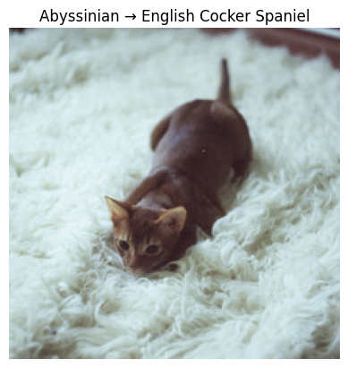

# 🐱➡️🐶 When Cats Become Dogs  
## 🔍 A Curious Study on Cat Breeds That Are Most Likely Misclassified as Dogs  

**本研究旨在找出：哪些貓品種最容易被圖像分類模型錯誤辨識成狗？**  
使用 PyTorch 與預訓練 ResNet18（ImageNet），在 Oxford‑IIIT Pet Dataset（3,680 張圖）上進行實驗、分析誤判行為，結果發現某些貓品種──例如 Birman──會被誤認為特定狗品種（如 Keeshond），既滑稽又發人深省。  

**This project asks a deceptively simple question:**  
**Which cat breeds are most likely to be mistaken for dogs by modern CNN classifiers?**  
Armed with a pretrained ResNet18 and the Oxford‑IIIT Pet Dataset, we catalog “cat→dog” misclassifications and reveal surprising cross‑species look‑alikes.  

---

## 📁 Project Structure  

```
```markdown
cat-vs-dog-misclassification-study/
├── README.md
├── cat_vs_dog_classification_study.ipynb   # 主實驗 Notebook
├── imgs/
│   ├── birman_keeshond.png                 # Birman → Keeshond 範例
│   └── abyssinian_spaniel.png              # Abyssinian → Cocker Spaniel 範例
├── stats/
│   ├── misclassified_summary.csv           # 誤判統計 CSV
│   └── confusion_chart.png                 # 誤判率長條圖
└── model/
└── best_resnet18.pth                   # 儲存的最佳模型 (可選)

````

---

## 🌟 Highlights | 重點

- ✅ **預訓練 ResNet18** on ImageNet  
- 🐾 **Oxford‑IIIT Pet Dataset**（37 品種，3,680 張影像）  
- 🔍 只統計 **Top‑3 皆為狗** 的“真實貓”樣本  
- 📊 匯總並排序「最常被誤判為狗」的貓品種  

---

## 📊 Sample Result | 誤判範例

```text
🐱 真實類別: Birman  
🔺 Top‑3 預測: ['Keeshond', 'Leonberger', 'Shiba Inu']
````


```text
🐱 真實類別: Abyssinian  
🔺 Top‑3 預測: ['English Cocker Spaniel', 'Scottish Terrier', 'Havanese']
````



---

## 📈 Statistics | 統計結果

| Cat Breed  | # Images | # Misclassified (Top‑3 all dogs) | Misclassification Rate |
| ---------- | -------- | -------------------------------- | ---------------------- |
| Birman     |  17      | 1                                | 5.88%                  |
| Abyssinian |  20      | 1                                | 5.00%                  |
| …          | …        | …                                | …                      |

*(範例數據，實際請參見 `stats/misclassified_summary.csv`)*


---

## 🔍 Methodology | 實驗方法

1. **Data Preparation**

   * 下載並解析 Oxford‑IIIT Pet Dataset
   * 提取 37 種品種名稱、標記其中 12 種為「貓」

2. **Model Training**

   * 載入預訓練 ResNet18，替換輸出層為 37 類
   * 80/20 切分 train/val，訓練 10 Epoch（驗證準確率 ≈ 82%）

3. **Misclassification Analysis**

   * 對驗證集所有「真實貓」樣本計算 Top‑3 預測
   * 當 Top‑3 中 **不含任何貓品種**，記為「誤判為狗」
   * 統計各貓品種誤判次數並計算比例

4. **Visualization**

   * 反正規化並顯示誤判樣本圖片
   * 繪製條狀圖、匯出 CSV

---

## 💡 Next Steps | 下一步

* **Two‑Stage Classifier**：先二分類（貓/狗），再做品種細分
* **Softmax Confidence Analysis**：計算「狗信心總和」，更精細衡量“像狗程度”
* **Human vs. AI Blind Test**：收集誤判樣本進行人類分辨實驗
* **Cartoon Data Augmentation**：嘗試加入動畫/卡通貓狗圖，檢視誤判變化

---

## 🎓 In the Spirit of the Ig Nobel Prize

> “First it makes you laugh, then it makes you think.”
>
> 本研究結合 AI 與荒謬美學，致敬所有「幽默中隱含洞見」的科學探索。

---

## 📜 License

This project is licensed under the **MIT License**.
本專案採用 **MIT 許可證**。
---
<footer>
  <p>2025 © When Cats Become Dogs
</p>
</footer>
